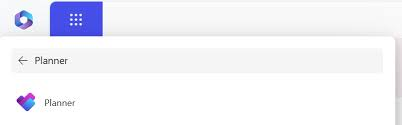
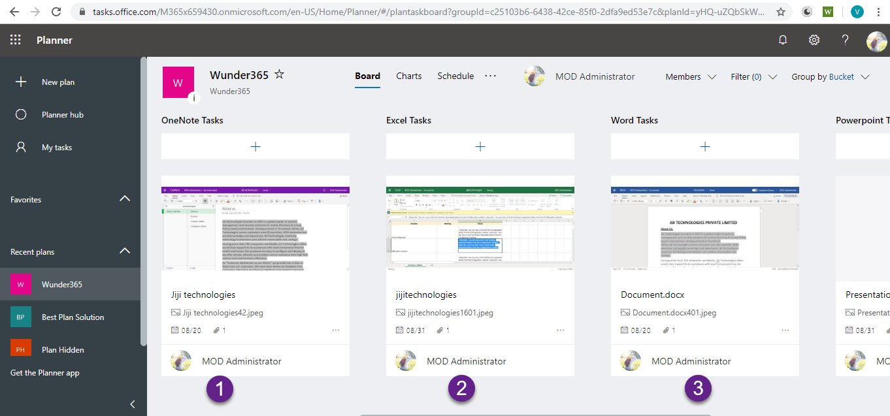

# Microsoft Planner User Guide  
*Version 1.0 | Last Updated: 2025-05-05*

## Overview  
Microsoft Planner is a task management application within the Microsoft 365 suite that enables teams to:  
- Organize work using visual boards  
- Track task ownership and progress  
- Collaborate within the Microsoft 365 ecosystem  

### Prerequisites  
- Microsoft 365 business or education subscription  
- Planner license (included in most M365 plans)  
- Edge/Chrome (v102+) or Firefox (v100+)  


## 1. Accessing Microsoft Planner  

### Web Browser  
1. Navigate to [https://tasks.office.com](https://tasks.office.com)  
2. Authenticate with organizational credentials  

### Microsoft Teams Integration  
1. Open your team channel  
2. Select the **+** icon to add a tab  
3. Choose **Planner** from the app gallery  

  
*Figure 1: Planner access methods*


## 2. Creating and Configuring Plans  

### 2.1 Initialize a New Plan  
```markdown
1. Select **+ New Plan** from the left navigation pane  
2. Complete the dialog:  
   - **Plan name**: [60 character limit]  
   - **Privacy setting**:  
     - *Public*: Visible to all group members  
     - *Private*: Restricted to specified members  
3. Click **Create Plan**  
```

### 2.2 Plan Properties  
Configure post-creation via the **Settings** (⚙️) menu:  
- **Classification**: Standard, Confidential  
- **Favorite status**: Pin to quick access  


## 3. Task Management  

### 3.1 Creating Tasks  
| Field | Requirement | Example |  
|-------|-------------|---------|  
| Title | Required (255 chars max) | "Develop login page UI" |  
| Bucket | Required | "Sprint 34" |  
| Assignee | Optional | user@domain.com |  
| Due Date | Optional | 2023-12-15 |  

### 3.2 Task Metadata  
Add via the task detail pane:  
- **Checklists**: Ordered subtasks (Ctrl+Enter for new lines)  
- **Labels**: Color-coded categories (max 25 per plan)  
- **Attachments**: Supported file types: .pdf, .docx, .xlsx (≤50MB)  

  
*Figure 2: Task menu*


## 4. Workflow Management  

### 4.1 Board Views  
- **Status columns**: Default buckets (To Do, In Progress, Done)  
- **Custom workflows**: Right-click bucket headers to rename  

### 4.2 Progress Tracking  
Access the **Charts** view for:  
- Completion percentage  
- Overdue task count  
- Workload distribution  


## 5. Integration Capabilities  

### Supported Microsoft 365 Integrations  
| Service | Integration Level |  
|---------|-------------------|  
| Teams | Deep (tab embedding) |  
| Outlook | Calendar sync |  
| OneDrive | File attachment |  
| Power Automate | Trigger-based automation |  


## Troubleshooting  

### Common Issues  

#### Authentication Failures  
**Symptom**: "We couldn't connect to Planner" error  
**Resolution**:  
1. Clear browser cache (Ctrl+Shift+Del)  
2. Verify Azure AD permissions  

#### Missing Features  
**Symptom**: No "New Plan" button  
**Resolution**:  
- Confirm Plan 1+ license assignment in [Microsoft 365 Admin Center](https://admin.microsoft.com)  

## Best Practices  
1. **Naming Conventions**:  
   - Plans: `[Department]-[Project]-[FY]` (e.g., "MKT-WebsiteRedesign-FY23")  
   - Buckets: Mirror development phases (Discovery, Development, QA)  

2. **Security**:  
   - Set Confidential plans to Private  
   - Audit permissions quarterly  


## Appendix  

### Keyboard Shortcuts  
| Action | Shortcut |  
|--------|----------|  
| New Task | T |  
| Save Changes | Ctrl+S |  
| Navigate Tasks | ↑/↓ arrows |  

### Support Resources  
- [Official Microsoft Documentation](https://learn.microsoft.com/en-us/microsoft-365/planner/)  
- [Planner Community Forum](https://techcommunity.microsoft.com/t5/microsoft-planner/ct-p/MicrosoftPlanner)  

```
